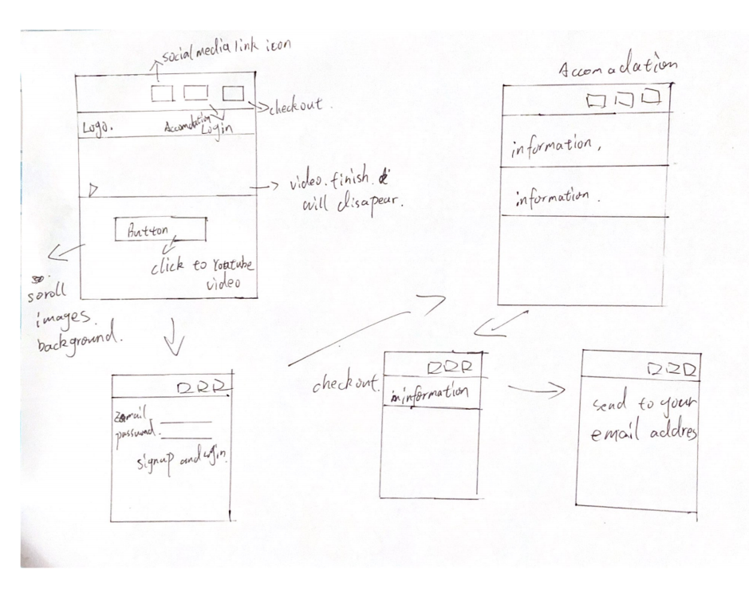

# HamiltonTourism

# sit-305-assignment-2

This is a sit305 assignment 2 mobile app

student name: Kunyuan Ye 
student id: 218589875

gitlink: https://github.com/mechanicRyan/HamiltonTourism.git

remote git repository: origin contains 5 branches, each branches are updated each weekly updates！！！

!!!because I am not familiar with github and git, I have tried millions of time to solve the commit caused confliact, it did not success, so I tried another methond, I created 5 branches, each each branches are updated each weekly updates！！！

Final version of project location: https://github.com/mechanicRyan/HamiltonTourism

In this assignment, I am going to develop an island travel booking app, which allow users to book accomdations in our app. email booking system feature connect to the firebase. Also, I implement a youtube video in my app's home page.

Project draft desgin idea and layout

